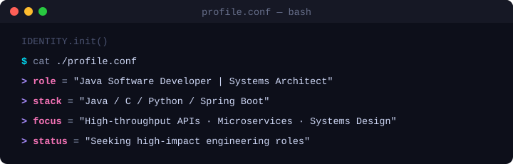

<div align="center">

<!-- Animated Header Banner — bg matched to GitHub dark (#0d1117) -->


<!-- Typing Animation (herokuapp — more reliable on GitHub) -->


</div>

---

## ◈ About Me

<div align="center">
  
</div>

---

## ◈ Tech Arsenal

<div align="center">

### ☕ Core Languages


### 🛠️ Backend & Tools


### 🗄️ Data & Infrastructure


### 🧰 Dev Environment


</div>

---

## ◈ What I Build

<div align="center">

| Domain | Description | Status |
|--------|-------------|--------|
| 🏗️ **Decoupled Architecture** | Designing systems using DI, service layers, and clean boundaries | Active |
| 💾 **Persistent Data Engines** | Custom storage systems, query optimization, data pipelines | Active |
| 🔄 **Dynamic Identity Systems** | QR-based identity & verification infrastructure | Shipped ✅ |
| ⚙️ **Backend APIs** | RESTful services, async processing, event-driven systems | Ongoing |

</div>

---

## ◈ GitHub Stats

<div align="center">
  
  
</div>

---

## ◈ Achievements

<div align="center">

```
╔══════════════════════════════════════════════════════════╗
║                 🏆  HALL OF ACHIEVEMENTS                 ║
╠══════════════════════════════════════════════════════════╣
║  🥇  GDG Code-a-thon          →  1st Place Winner        ║
║  🔄  Dynamic QR Identity System →  Shipped & Deployed    ║
║  🏗️  Decoupled Backend Engine  →  In Production          ║
╚══════════════════════════════════════════════════════════╝
```

</div>

---

## ◈ Design Philosophy

<div align="center">

> *"Write code like you're writing a letter to the next engineer — be clear, be kind, be precise."*

</div>

```
Separation of Concerns  ──────────────────────────► ████████████ 100%
SOLID Principles        ──────────────────────────► ███████████░  92%
Clean Architecture      ──────────────────────────► ██████████░░  88%
Test-Driven Development ──────────────────────────► █████████░░░  80%
Performance Engineering ──────────────────────────► ████████░░░░  75%
```

---

## ◈ Currently Exploring

<div align="center">


</div>

---

## ◈ Connect

<div align="center">

<a href="https://www.linkedin.com/in/rohan-bisht-0735771a1/">
  
</a>
&nbsp;
<a href="https://x.com/im_rb28">
  
</a>
&nbsp;
<a href="https://github.com/RohanBisht33">
  
</a>

</div>

---

<div align="center">


</div>

<!-- Footer Wave — bg matched to GitHub dark (#0d1117) -->


<div align="center">
  
</div>
